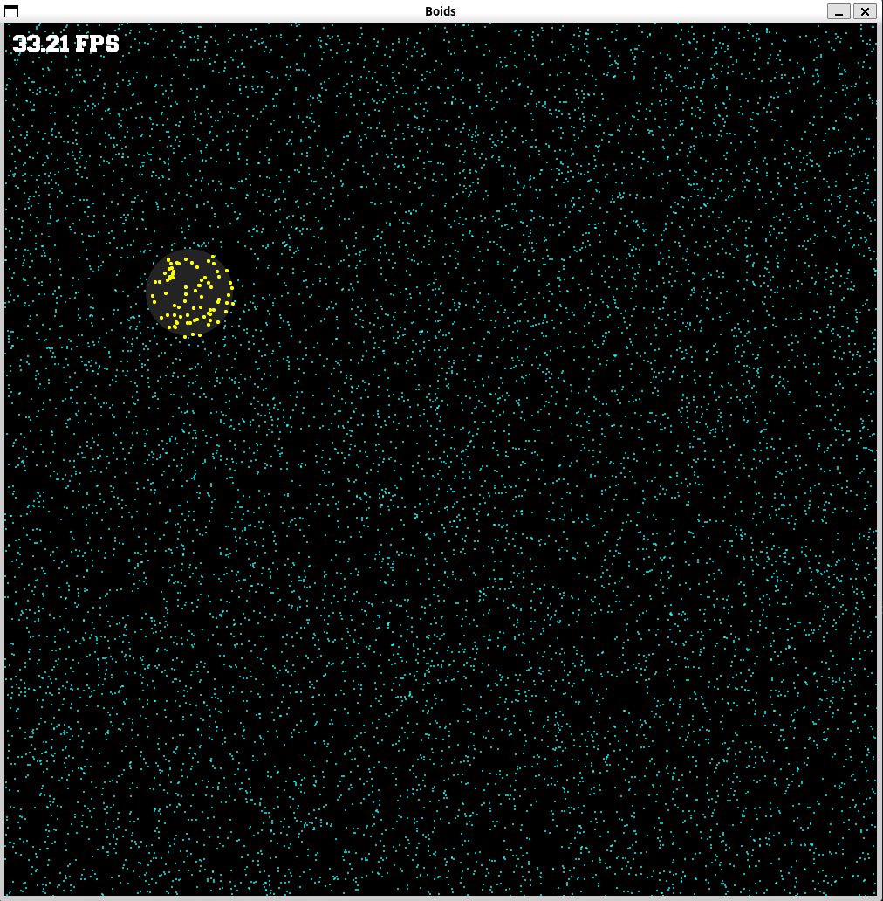

# Fast nearby search for boid simulation

This is a simple boid simulation with a fast nearby search algorithm. It uses the Boost Rtree to store the boids and find the nearby boids. The Rtree is a spatial index that uses a bounding box hierarchy to store the boids. The Rtree is updated every frame to reflect the current position of the boids.

